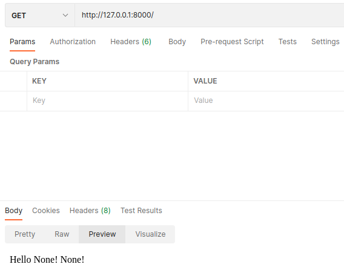
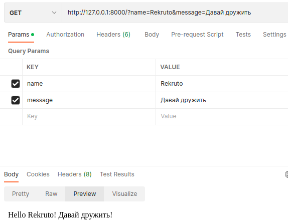

# Simple_django_service

Веб-сервис, который принимает параметры по GET запросу и возвращает строку с приветствием, 
содержащую данные параметры.

## Site page examples
1. GET запрос без параметров:


2. GET запрос с параметрами:


## Installation
Заполните файл .env:
```bash
SECRET_KEY=
ALLOWED_HOSTS=
```
Выполните следующую команду:
```bash
pip install -r requirements.txt
```
Запустите Django сервер:
```bash
python manage.py runserver
```
## Alternative Installation
Заполните файл .env:
```bash
SECRET_KEY=
ALLOWED_HOSTS=
```
Выполните следующую команду:
```bash
docker-compose up
```